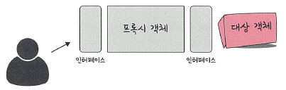
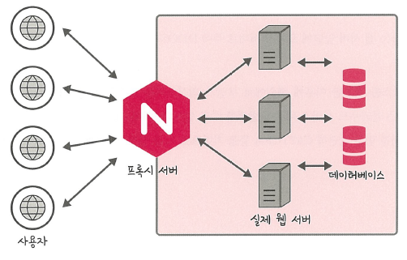
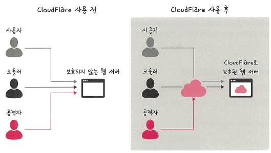
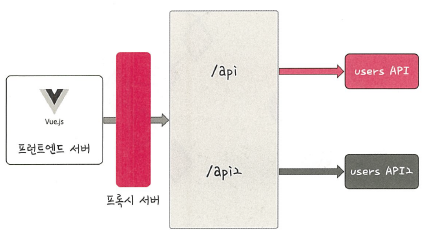

# 📘 프록시 패턴과 프록시 서버

---

## 🔹 프록시 패턴 (Proxy Pattern)

### 🧩 프록시 패턴이란?

> 대상 객체(Subject)에 접근하기 전 그 접근을 제어하거나, 흐름을 가로채 대상 객체의 접근을 **필터링**하거나 **수정**하는 역할을 수행하는 디자인 패턴입니다.

---

### ✅ 사용 목적

- 🔒 **보안(Security)**: 민감한 객체에 대한 직접 접근 차단  
- ✅ **검증(Validation)**: 요청 데이터의 유효성 검증  
- 🔁 **변환(Transformation)**: 요청을 수정 후 전달  
- 💾 **캐싱(Caching)**: 중복된 요청에 대해 결과를 재사용  
- 📝 **로깅(Logging)**: 요청/응답 기록  
- 🕐 **지연 초기화(Lazy Initialization)**

---

### ✅ 구조

📌 클라이언트 → 인터페이스 → 프록시 객체 → 인터페이스 → 실제 대상 객체

---

## 🔹 프록시 서버 (Proxy Server)

### ✅ 개념

프록시 서버는 **클라이언트와 서버 사이에 위치**하여,  
클라이언트가 다른 서버에 **간접적으로 접속**하도록 중개 역할을 수행하는  
**네트워크 시스템 또는 응용 프로그램**입니다.

---

### ✅ 역할

- 🚫 요청 필터링 / 변환 / 캐싱  
- 🔐 보안 강화 (IP 차단, 접근 제한 등)  
- ⚖️ 트래픽 제어 및 로드 밸런싱  
- 🕵️ 사용자 IP 숨기기

---

### ✅ 프록시 서버의 예시: **nginx**

- ⚙️ 이벤트 기반 구조로 고성능 처리 가능  
- 🔄 다수의 연결을 효과적으로 처리  
- 🛡️ 실제 Node.js 서버 앞단에 nginx를 배치하여 보안을 강화  
- 🔗 직접 접근을 차단하고 **간접적으로 한 단계를 거치게 함**

📌 Node.js 창시자 Ryan Dahl:

> **"Node.js의 버퍼 오버플로우 취약점을 예방하려면 nginx를 프록시 서버로 두는 것이 좋다."**

📌 nginx → 실제 웹 서버 및 DB 라우팅 구조

---

## 🔹 보안 강화 사례: Cloudflare

**Cloudflare**는 프록시 형태의 **보안 솔루션**으로 다음과 같은 이점을 가집니다.

### ✅ DDOS 공격 방어

- 🚫 의심스러운 트래픽 차단  
- 🛡️ 대량 요청이 서버에 도달하지 않도록 필터링  
- 📈 대규모 DDOS 공격 효과적으로 방어

📌 Cloudflare는 의심스러운 요청을 서버로 보내지 않고 자체적으로 차단하여  
웹 서버의 **가용성 유지**와 **보안 강화**를 동시에 실현할 수 있습니다.

---

### ✅ HTTPS 구축 지원

- 🔐 인증서 없이도 Cloudflare를 통해 HTTPS 적용 가능  
- 🔒 트래픽 암호화 → 데이터 보호

📌 인증서 발급 없이 HTTPS를 적용할 수 있어 개발자 입장에서 매우 편리

📌 Cloudflare 사용 전/후 구조 비교

---

## 🔹 프록시 서버를 활용한 API 구조

### ✅ 프론트엔드 ↔ 백엔드 간 통신 예시

- 💡 프론트엔드(Vue.js 등) 앞단에 프록시 서버를 두어 **API 요청을 중계**
- 예시:
/api → users API
/api2 → users API2

- 🌐 **CORS 에러 해결**에도 효과적
- 🔀 여러 백엔드 서버와의 **유연한 통신** 지원

#### ✅ 로컬 개발 환경에서
- `127.0.0.1` 등의 루프백 주소를 사용하여  
프록시 서버가 API 요청을 받아 실제 API 서버로 전달  

---

### 📘 **용어 정리**
| 용어         | 설명                                                               |
| ---------- | ---------------------------------------------------------------- |
| 프록시 패턴     | 객체에 대한 접근을 제어하거나 요청 흐름을 가로채 기능을 확장하는 디자인 패턴                      |
| 프록시 서버     | 클라이언트와 서버 사이에서 중개 역할을 수행하는 네트워크 서버 또는 애플리케이션                     |
| nginx      | 고성능 프록시 서버로, 이벤트 기반 구조로 다수의 연결을 효율적으로 처리함                        |
| Cloudflare | DDOS 방어 및 HTTPS 지원 등을 제공하는 프록시 형태의 보안 솔루션                        |
| CORS       | 출처가 다른 리소스에 대한 요청을 브라우저가 제한하는 정책 (Cross-Origin Resource Sharing) |
| 로드 밸런싱     | 여러 서버로 요청을 분산시켜 트래픽을 효율적으로 분산하는 기술                               |
| 지연 초기화     | 실제 객체의 생성을 요청이 들어올 때까지 미루는 방식                                    |
