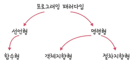

## 🔖 선언형과 함수형 프로그래밍 (declarative programming & functional programming)

> **선언형 프로그래밍** "무엇을 할 것인가(What)"에 집중하는 프로그래밍 패러다임
> 
> **함수형 프로그래밍** 선언형 프로그래밍의 한 분류, 수학적 '함수' 개념에 기반한 패러다임

---

### 선언형 프로그래밍 (Declarative Programming)
- 로직의 **과정(how)**보다 **목표(what)**를 표현
- 코드가 간결하고 직관적, 가독성이 좋음
- 대표 예시: SQL, HTML, React (JSX 등)

#### 💡 일상 예시
> **배달 앱에서 '치킨' 검색**  
> → 치킨이 뭔지, 어디서 오는지는 몰라도 결과는 도착함  
> (= 내가 *무엇을 원한다*만 표현)

---

### 함수형 프로그래밍 (Functional Programming)
- **선언형 프로그래밍의 하위 개념**
- **수학적 함수** 개념에 기반
- 핵심은 **순수 함수**와 **부작용 최소화**
- 고차 함수, 불변성, 재귀 등을 활용
- 재사용성과 테스트 용이성이 높음
- 대표 예시: Haskell, Elm, JavaScript(ES6+에서 활용 가능)
  
#### 💡 일상 예시
> **자동판매기**  
> → 같은 금액(입력)을 넣으면 항상 같은 음료(출력)가 나옴  
> → 외부 상태(날씨나 기분 등)에 영향받지 않음  
> (= 순수 함수의 개념)

---



| 분류 | 설명 |
|------|------|
| **선언형 (Declarative)** | **무엇을 할지에 집중** *ex: SQL, HTML, React JSX* |
| └ 함수형 (Functional) | 순수 함수와 불변성 중심. *ex: Haskell, JavaScript(ES6+)* |
| **명령형 (Imperative)** | **어떻게 할지에 집중** |
| ├ 객체지향형 (OOP) | 객체와 클래스 중심. *ex: Java, Python, C++* |
| └ 절차지향형 (Procedural) | 순서 기반 처리 흐름. *ex: C, Pascal* |

---

### 🧭 핵심 차이 요약

- 선언형: **무엇**을 할지 → 시스템이 알아서 처리
- 명령형: **어떻게** 할지 → 개발자가 명령 순서를 직접 지정

---

### 순수 함수 (Pure Function)
> 출력이 오직 **입력값에만 의존**하고, 외부 상태에 영향 주지 않음
> 즉, **부작용(side effect)**이 전혀 없는 함수

```js
// ✅ 순수 함수 예시
function add(a, b) {
  return a + b;
}

예를 들어 같은 두 숫자를 넣으면 항상 같은 결과를 반환하며, 외부 변수나 상태를 건드리지 않는다.
이는 함수형 프로그래밍의 핵심으로, 예측 가능한 코드를 만드는 데 도움을 준다.

```
---
### 고차 함수 (Higher-order Function)
> **함수를 인자로 받거나 반환하는 함수** 
- 고차 함수를 사용하기 위해선 해당 언어가 **일급 객체(First-class citizens)** 를 지원해야 함
- ex) JavaScript의 map, filter, forEach, reduce 등이 있다.
- 로직의 유연성과 재사용성을 높여줌

```js
// ✅ 고차 함수 예시
function greet(name) {
  return `Hello, ${name}`;
}

function processUser(name, callback) {
  return callback(name);
}
processUser("연지", greet); // Hello, 연지
```


#### 일급 객체(First-class Citizen)
> 함수를 값처럼 자유롭게 다룰 수 있는 성질

#### 일급 객체의 조건
- 변수나 매서드에 함수를 할당할 수 있다
- 함수 안에 함수를 매개변수로 담을 수 있다
- 함수가 함수를 변환 가능


#### 💡 일상 예시
"커피 자판기"
자판기(고차 함수) 안에
"커피" / "라떼" / "코코아"라는 다른 음료 만드는 함수(콜백 함수)를 넣을 수 있음
자판기는 버튼에 따라 다른 함수를 실행함

---
## ✅ 장단점

### ⚖️ 함수형 프로그래밍의 장단점

| 장점 | 단점 |
|------|------|
| 동일한 입력 → 항상 동일한 출력 → **예측 가능한 코드** | ❌ 학습 곡선이 있음 (초보자에겐 익숙하지 않음) |
| 상태 변경이 없어 **디버깅과 테스트가 쉬움** | ❌ 복잡한 상태 처리(예: 게임 상태)는 불편할 수 있음 |
| **함수 재사용성**, 유지보수성 우수 | ❌ 성능이 중요한 경우엔 명령형보다 느릴 수 있음 |
| 병렬 처리나 동시성에 유리 | ❌ 재귀 중심 구조는 메모리 부담이 커질 수 있음 |

---

## ✅ 활용 사례


| 상황 | 설명 |
|------|------|
| **복잡한 상태를 피하고 싶을 때** | 상태 변경이 없기 때문에 디버깅이 쉬움 |
| **예측 가능한 로직이 필요할 때** | 금융 계산, 수학적 알고리즘, 상태 기반 오류 최소화 |
| **동시성/병렬 처리 시스템** | 부작용이 없어서 스레드 충돌 걱정 없이 병렬 처리 가능 |
| **프론트엔드 개발** | React, Vue 등은 선언형 & 함수형 스타일을 적극 활용 |
| **데이터 처리/분석** | JavaScript의 `map`, `filter`, `reduce`를 활용한 데이터 흐름 처리 |

---

### 💡 대표 활용 예시

| 분야 | 예시 |
|------|------|
| **웹 프론트엔드** | React(JSX + 함수형 스타일)에서 컴포넌트를 함수처럼 작성 |
| **백엔드 로직 처리** | 순수 함수 기반의 비즈니스 로직 설계, 테스트 코드 작성 |
| **데이터 파이프라인** | JavaScript, Python에서 map/reduce로 데이터 변환 처리 |
| **수학적 계산 로직** | Haskell, Scala 등에서 수학/통계 알고리즘 처리 |
| **클린 코드 지향 프로젝트** | 함수 단위로 쪼개고 재사용성 높은 구조 설계 시 유리 |

---

### ✅ 요약 한 줄 정리

> 함수형 프로그래밍은 **예측 가능하고 유지보수가 쉬운 코드 작성**을 위한 강력한 도구이며,  
> 특히 **상태 관리, 동시성, 테스트**가 중요한 분야에서 효과적으로 사용된다. 
